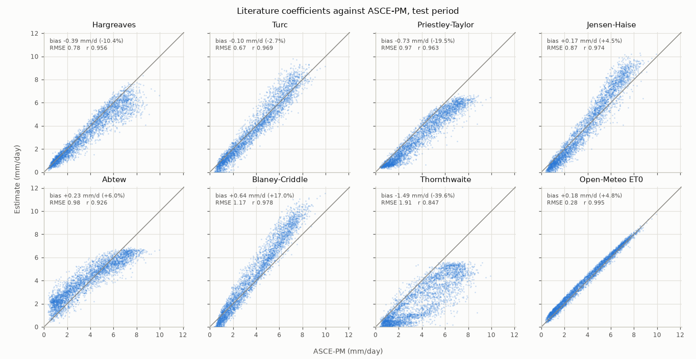
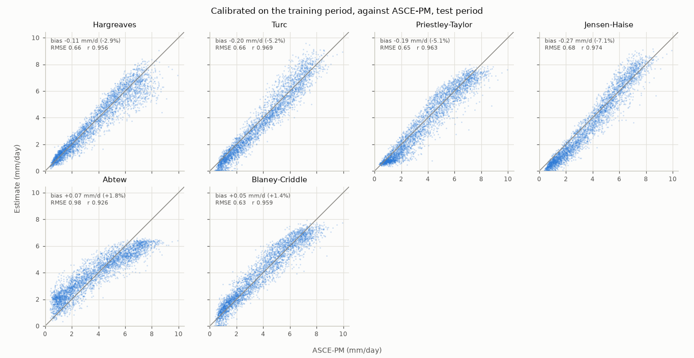
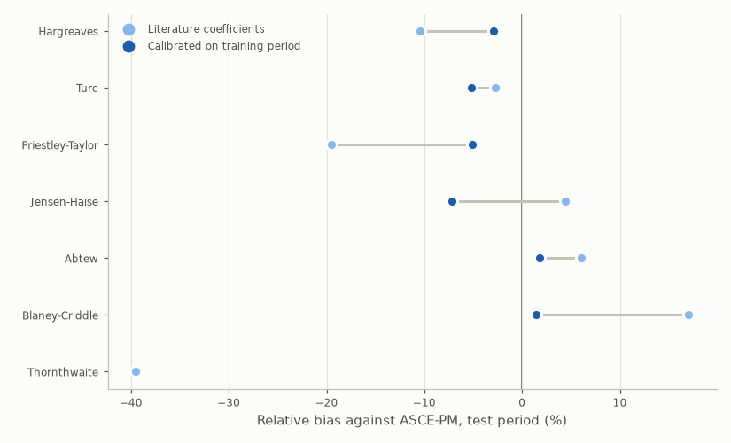
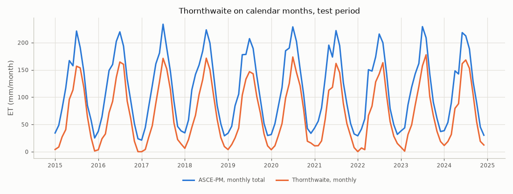
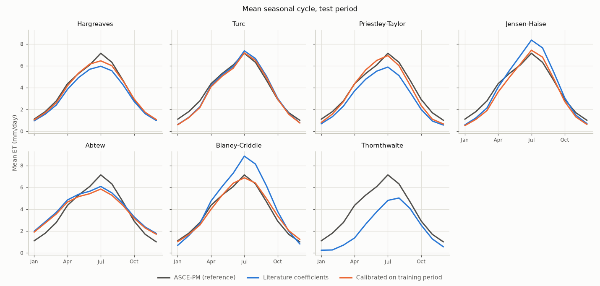

# Validation of the ET equations

Generated by `python -m fao_model.validate` on 2026-10-09.

- Data: Konya Plain (Cumra), Turkiye (37.57° N, 32.78° E, 1013.0 m), 1995-01-01 to 2024-12-31, 10958 days; Open-Meteo historical weather API (https://open-meteo.com/), CC BY 4.0, model `era5`.
- Training period: 1995-01-01 to 2015-01-01 (exclusive), 7305 days; test period: 2015-01-01 to 2024-12-31, 3653 days.
- Reference: daily ASCE-PM grass reference ET (FAO-56) computed by this repo, unless stated otherwise. Bias = estimate − reference.
- Calibration fits each coefficient by least squares on the training period only; the test period shows how well that transfers to unseen years.

## 1. ASCE-PM implementation against Open-Meteo ET0

Open-Meteo computes FAO-56 ET0 from hourly ERA5 data and sums it per day; this repo computes it from daily values. Both use the same weather, so this checks the implementation, not the physics.

| Period | Bias (mm/day) | Relative bias (%) | RMSE (mm/day) | r | NSE |
|---|---|---|---|---|---|
| Training | -0.19 | -4.8 | 0.28 | 0.995 | 0.98 |
| Test | -0.18 | -4.6 | 0.28 | 0.995 | 0.98 |
| All | -0.18 | -4.8 | 0.28 | 0.995 | 0.98 |

## 2. Literature coefficients (test period)

| Method | Bias (mm/day) | Relative bias (%) | RMSE (mm/day) | r | NSE |
|---|---|---|---|---|---|
| Hargreaves | -0.39 | -10.4 | 0.78 | 0.956 | 0.88 |
| Turc | -0.10 | -2.7 | 0.67 | 0.969 | 0.91 |
| Priestley-Taylor | -0.73 | -19.5 | 0.97 | 0.963 | 0.81 |
| Jensen-Haise | +0.17 | +4.5 | 0.87 | 0.974 | 0.85 |
| Abtew | +0.23 | +6.0 | 0.98 | 0.926 | 0.81 |
| Blaney-Criddle | +0.64 | +17.0 | 1.17 | 0.978 | 0.73 |
| Thornthwaite | -1.49 | -39.6 | 1.91 | 0.847 | 0.27 |

## 3. Calibrated on the training period

In-sample RMSE (training period) next to the out-of-sample statistics (test period). Thornthwaite has no calibration coefficient.

| Method | Training RMSE | Test bias (mm/day) | Test relative bias (%) | Test RMSE (mm/day) | Test r | Test NSE |
|---|---|---|---|---|---|---|
| Hargreaves | 0.63 | -0.11 | -2.9 | 0.66 | 0.956 | 0.91 |
| Turc | 0.67 | -0.20 | -5.2 | 0.66 | 0.969 | 0.91 |
| Priestley-Taylor | 0.60 | -0.19 | -5.1 | 0.65 | 0.963 | 0.91 |
| Jensen-Haise | 0.69 | -0.27 | -7.1 | 0.68 | 0.974 | 0.91 |
| Abtew | 0.99 | +0.07 | +1.8 | 0.98 | 0.926 | 0.80 |
| Blaney-Criddle | 0.60 | +0.05 | +1.4 | 0.63 | 0.959 | 0.92 |
| Thornthwaite | – | – | – | – | – | – |

## 4. Does the calibration reference matter?

Coefficients fitted on the training period against two references. Test RMSE is measured against the reference each set was fitted to.

| Coefficient | Literature | Fitted to ASCE-PM | Fitted to Open-Meteo ET0 |
|---|---|---|---|
| Hargreaves a | 1.000 | 1.084 | 1.125 |
| Turc a | 1.000 | 0.975 | 1.010 |
| Abtew k | 0.530 | 0.509 | 0.531 |
| Priestley-Taylor α | 1.260 | 1.485 | 1.536 |
| Jensen-Haise a | 1.000 | 0.889 | 0.920 |
| Blaney-Criddle a | FAO-24 (daily) | -1.788 | -1.533 |
| Blaney-Criddle b | FAO-24 (daily) | 1.325 | 1.308 |

| Method | Test RMSE, fitted to ASCE-PM | Test RMSE, fitted to Open-Meteo ET0 |
|---|---|---|
| Hargreaves | 0.66 | 0.62 |
| Turc | 0.66 | 0.64 |
| Priestley-Taylor | 0.65 | 0.73 |
| Jensen-Haise | 0.68 | 0.73 |
| Abtew | 0.98 | 0.86 |
| Blaney-Criddle | 0.63 | 0.67 |

## 5. Thornthwaite on calendar months

Thornthwaite is a monthly method. Heat index I = 63.7 from the training-period monthly climatology. Daily values in the tables above use the trailing 30-day mean temperature; here the method gets calendar-month means and is compared with monthly ASCE-PM totals.

| Time step | Bias | Relative bias (%) | RMSE | r | NSE |
|---|---|---|---|---|---|
| Calendar month (mm/month) | -44.3 | -38.6 | 47.9 | 0.966 | 0.45 |
| Daily rate (mm/day) | -1.49 | -39.6 | 1.91 | 0.847 | 0.27 |

## 6. Seasonal cycle

Mean daily ET per calendar month over the test period (mm/day).

| Series | Jan | Feb | Mar | Apr | May | Jun | Jul | Aug | Sep | Oct | Nov | Dec |
|---|---|---|---|---|---|---|---|---|---|---|---|---|
| ASCE-PM (reference) | 1.10 | 1.80 | 2.78 | 4.35 | 5.28 | 6.07 | 7.14 | 6.31 | 4.66 | 2.91 | 1.69 | 1.00 |
| Open-Meteo ET0 | 1.26 | 1.99 | 2.94 | 4.51 | 5.38 | 6.13 | 7.22 | 6.45 | 4.97 | 3.25 | 1.99 | 1.20 |
| Hargreaves, literature | 0.95 | 1.57 | 2.40 | 3.84 | 4.92 | 5.67 | 5.95 | 5.54 | 4.26 | 2.73 | 1.60 | 0.98 |
| Hargreaves, calibrated | 1.03 | 1.70 | 2.61 | 4.16 | 5.33 | 6.15 | 6.45 | 6.00 | 4.62 | 2.96 | 1.73 | 1.07 |
| Turc, literature | 0.61 | 1.27 | 2.23 | 4.17 | 5.17 | 5.93 | 7.37 | 6.66 | 5.04 | 3.02 | 1.60 | 0.77 |
| Turc, calibrated | 0.59 | 1.24 | 2.18 | 4.07 | 5.04 | 5.78 | 7.18 | 6.49 | 4.91 | 2.94 | 1.56 | 0.76 |
| Priestley-Taylor, literature | 0.68 | 1.33 | 2.30 | 3.69 | 4.76 | 5.51 | 5.88 | 5.10 | 3.58 | 2.00 | 0.93 | 0.57 |
| Priestley-Taylor, calibrated | 0.81 | 1.57 | 2.71 | 4.35 | 5.61 | 6.49 | 6.93 | 6.01 | 4.21 | 2.35 | 1.10 | 0.67 |
| Jensen-Haise, literature | 0.58 | 1.22 | 2.13 | 4.03 | 5.53 | 6.93 | 8.35 | 7.64 | 5.43 | 3.05 | 1.47 | 0.70 |
| Jensen-Haise, calibrated | 0.51 | 1.09 | 1.90 | 3.58 | 4.92 | 6.16 | 7.42 | 6.79 | 4.83 | 2.71 | 1.31 | 0.62 |
| Abtew, literature | 1.98 | 2.84 | 3.71 | 4.84 | 5.36 | 5.64 | 6.08 | 5.49 | 4.51 | 3.29 | 2.36 | 1.77 |
| Abtew, calibrated | 1.90 | 2.73 | 3.57 | 4.65 | 5.15 | 5.41 | 5.84 | 5.27 | 4.33 | 3.16 | 2.27 | 1.70 |
| Blaney-Criddle, literature | 0.68 | 1.58 | 2.69 | 4.74 | 6.07 | 7.29 | 8.86 | 8.13 | 6.13 | 3.79 | 1.98 | 0.81 |
| Blaney-Criddle, calibrated | 1.02 | 1.68 | 2.55 | 3.98 | 5.28 | 6.38 | 6.87 | 6.39 | 4.97 | 3.39 | 2.03 | 1.22 |
| Thornthwaite, literature | 0.24 | 0.26 | 0.71 | 1.36 | 2.62 | 3.77 | 4.80 | 5.02 | 4.05 | 2.54 | 1.27 | 0.55 |

